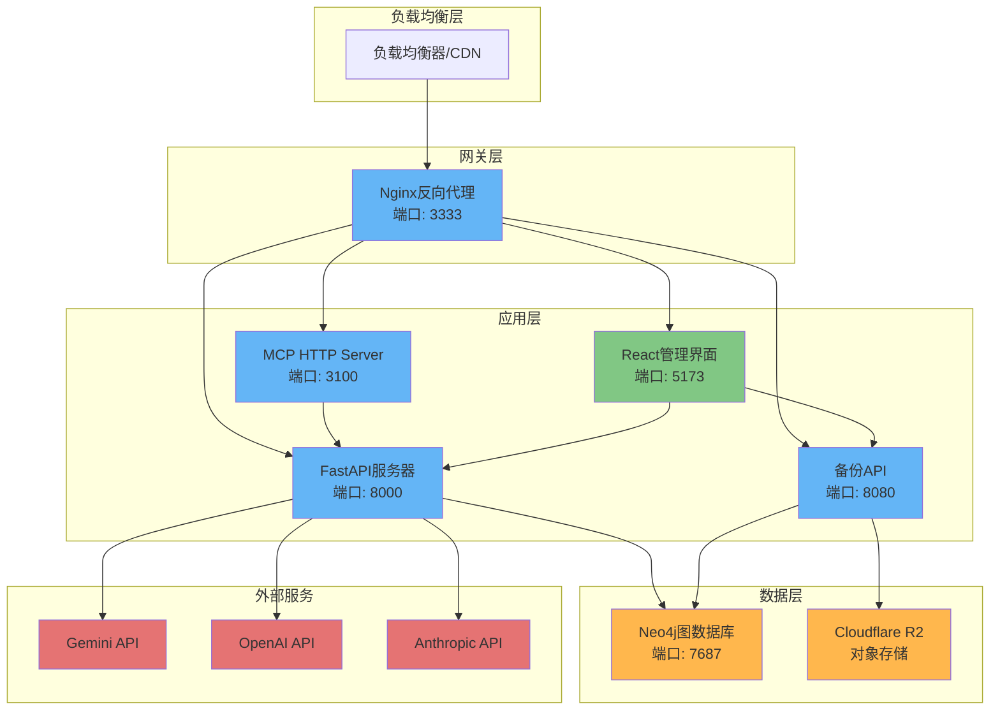
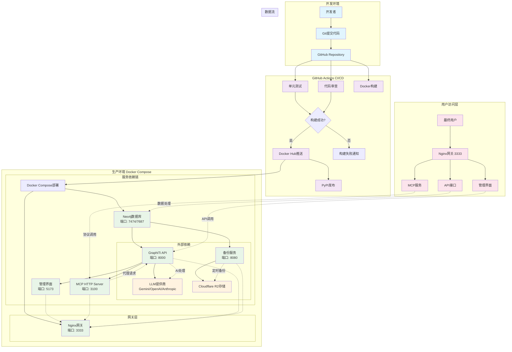

# GraphiTi 部署架构文档

> **文档更新时间**: 2025-10-27
> **版本**: v1.0
> **维护者**: Ultrathink

## 📋 目录

- [项目概述](#项目概述)
- [架构组件](#架构组件)
- [部署流程](#部署流程)
- [环境配置](#环境配置)
- [CI/CD流水线](#cicd流水线)
- [安全配置](#安全配置)
- [监控与维护](#监控与维护)
- [故障排除](#故障排除)

## 🎯 项目概述

GraphiTi是一个基于Python的时序感知知识图谱框架，专为AI代理设计。本文档详细说明了项目的完整部署架构，包括开发、测试、生产环境的部署流程。

### 核心特性

- **时序数据模型**: 双时态数据结构，显式跟踪事件发生时间
- **混合检索**: 语义嵌入 + 关键词搜索(BM25) + 图遍历
- **实时增量更新**: 无需批量重计算的知识图谱更新
- **MCP协议支持**: Model Context Protocol集成
- **多LLM提供商**: OpenAI、Anthropic、Gemini、Groq支持

## 🏗️ 架构组件

### 服务架构图



### 核心服务组件

| 服务 | 技术栈 | 端口 | 描述 | 健康检查 |
|------|--------|------|------|----------|
| **Neo4j** | Neo4j 5.26.0 | 7474/7687 | 图数据库 | HTTP:7474 |
| **GraphiTi API** | Python FastAPI + uvicorn | 8000 | 核心API服务 | `/healthcheck` |
| **MCP HTTP Server** | Node.js + Express | 3100 | MCP协议服务 | `/health` |
| **Backup Service** | Python + FastAPI | 8080 | 备份管理服务 | `/api/status` |
| **Admin UI** | React + Vite | 5173 | 管理界面 | N/A |
| **Nginx Gateway** | Nginx 1.27-alpine | 3333 | 反向代理网关 | N/A |

## 🔄 部署流程

### 完整部署流程图



### 部署步骤

#### 1. 环境准备

```bash
# 克隆项目
git clone https://github.com/zepai/graphiti.git
cd graphiti

# 复制环境配置
cp .env.example .env

# 编辑配置文件
vim .env
```

#### 2. 核心配置

**必需配置:**
```bash
# Neo4j数据库密码
NEO4J_PASSWORD=your-secure-neo4j-password

# LLM提供商配置 (选择其一)
LLM_PROVIDER=gemini
GOOGLE_API_KEY=your-google-api-key
MODEL_NAME=gemini-2.5-flash-lite
EMBEDDER_MODEL_NAME=gemini-embedding-001
```

**可选配置:**
```bash
# API认证 (公网部署推荐)
GRAPHITI_API_TOKEN=your-secure-token-here

# 备份配置
R2_ACCOUNT_ID=your-r2-account-id
R2_ACCESS_KEY_ID=your-r2-access-key-id
R2_SECRET_ACCESS_KEY=your-r2-secret-access-key
R2_BUCKET_NAME=your-r2-bucket-name
```

#### 3. 服务启动

```bash
# 启动所有服务
docker-compose up -d

# 检查服务状态
docker-compose ps

# 验证服务健康状态
curl http://localhost:3333/health
```

## ⚙️ 环境配置

### 开发环境

```bash
# 本地开发端口
- Nginx网关: 3333
- GraphiTi API: 8000
- MCP Server: 3100
- Admin UI: 5173
- Neo4j UI: 7474
- Neo4j Bolt: 7687
```

### 生产环境

```bash
# 外部访问端口 (仅3333暴露)
- 统一入口: 3333 (Nginx)
- 内部服务不直接暴露
- Neo4j仅本地访问 (127.0.0.1)
```

### Docker Compose 服务配置

```yaml
services:
  # 数据库层
  neo4j:
    image: neo4j:5.26.0
    ports: ["127.0.0.1:7474:7474", "127.0.0.1:7687:7687"]
    volumes: [neo4j_prod_data:/data, neo4j_prod_logs:/logs]

  # 核心API服务
  graphiti-api:
    build: { context: ., dockerfile: server/Dockerfile }
    depends_on: [neo4j]

  # MCP协议服务
  mcp-http-server:
    build: { context: ., dockerfile: mcp-http-server/Dockerfile }
    depends_on: [graphiti-api]

  # 备份服务
  neo4j-backup:
    build: { context: ., dockerfile: neo4j-backup/Dockerfile }
    depends_on: [neo4j]

  # 管理界面
  graphiti-admin:
    build: { context: ./graphiti-admin, dockerfile: Dockerfile }
    depends_on: [graphiti-api, neo4j-backup]

  # 网关
  gateway:
    image: nginx:1.27-alpine
    ports: ["3333:80"]
    depends_on: [mcp-http-server, graphiti-admin, graphiti-api, neo4j-backup]
```

## 🚀 CI/CD流水线

### GitHub Actions 工作流

#### 主要工作流文件

| 工作流 | 触发条件 | 功能 |
|--------|----------|------|
| `unit_tests.yml` | Push/PR | 单元测试执行 |
| `code-review.yml` | Push/PR | Claude代码审查 |
| `mcp-server-docker.yml` | Push to main | MCP服务器Docker构建 |
| `release-graphiti-core.yml` | Git tags | PyPI包发布 |

#### MCP服务器构建流程

```yaml
name: Build and Push MCP Server Docker Image
on:
  push:
    paths: ["mcp_server/pyproject.toml"]
    branches: ["main"]
  workflow_dispatch:

env:
  REGISTRY: docker.io
  IMAGE_NAME: zepai/knowledge-graph-mcp

jobs:
  build-and-push:
    runs-on: depot-ubuntu-24.04-small
    steps:
      - name: Checkout repository
      - name: Extract version from pyproject.toml
      - name: Log in to Docker Hub
      - name: Set up Depot CLI
      - name: Extract metadata
      - name: Depot build and push image
```

#### PyPI发布流程

```yaml
name: Release to PyPI
on:
  push:
    tags: ["v*.*.*"]

jobs:
  release:
    runs-on: ubuntu-latest
    environment: release
    steps:
      - uses: actions/checkout@v4
      - name: Set up Python 3.11
      - name: Install uv
      - name: Compare pyproject version with tag
      - name: Build project for distribution
      - name: Publish package distributions to PyPI
```

### 自动化部署流程

1. **代码提交** → 触发GitHub Actions
2. **自动测试** → 单元测试、代码质量检查
3. **Docker构建** → 多平台镜像构建 (amd64/arm64)
4. **镜像推送** → Docker Hub注册表
5. **版本发布** → PyPI包发布 (仅标签推送)

## 🔒 安全配置

### 认证机制

#### 1. API Token认证

```bash
# 生成安全token
GRAPHITI_API_TOKEN=$(openssl rand -hex 32)

# 客户端请求示例
curl -X POST http://localhost:3333/mcp \
  -H "X-GraphiTi-Token: your-api-token" \
  -d '{"jsonrpc":"2.0","method":"tools/list"}'
```

#### 2. 服务间认证

- **MCP Server → GraphiTi API**: Bearer Token传递
- **Admin UI → API**: 环境变量配置
- **备份服务**: R2签名认证

### 网络安全

#### 1. 端口访问控制

```yaml
# 仅本地访问的端口
- Neo4j HTTP: 127.0.0.1:7474
- Neo4j Bolt: 127.0.0.1:7687

# 内部服务端口 (仅Docker网络)
- GraphiTi API: 8000
- MCP Server: 3100
- Backup API: 8080
- Admin UI: 5173

# 外部访问端口
- Nginx网关: 3333
```

#### 2. HTTPS反向代理

**Nginx配置示例:**
```nginx
server {
    listen 443 ssl http2;
    server_name api.your-domain.com;

    ssl_certificate /path/to/cert.pem;
    ssl_certificate_key /path/to/key.pem;

    location / {
        proxy_pass http://localhost:8000;
        proxy_set_header Host $host;
        proxy_set_header X-Real-IP $remote_addr;
    }
}
```

**Caddy配置示例:**
```
api.your-domain.com {
    reverse_proxy localhost:8000
}

mcp.your-domain.com {
    reverse_proxy localhost:3100
}
```

### 安全检查清单

- [ ] 设置强密码和API Token
- [ ] 启用HTTPS加密传输
- [ ] 配置防火墙规则
- [ ] 定期更新依赖包
- [ ] 启用备份加密
- [ ] 监控异常访问日志
- [ ] 定期轮换密钥

## 📊 监控与维护

### 健康检查端点

| 服务 | 端点 | 方法 | 响应 |
|------|------|------|------|
| GraphiTi API | `/healthcheck` | GET | 200 OK |
| MCP Server | `/health` | GET | 200 OK |
| Backup Service | `/api/status` | GET | 200 OK |
| Neo4j | `http://localhost:7474` | GET | 200 OK |

### 监控指标

#### 1. 服务健康状态

```bash
# 检查所有服务状态
docker-compose ps

# 查看服务日志
docker-compose logs -f [service-name]

# 检查资源使用
docker stats
```

#### 2. 应用层监控

```python
# GraphiTi API健康检查
GET /healthcheck
Response: {"status": "healthy", "timestamp": "2025-10-27T..."}

# MCP服务器健康检查
GET /health
Response: {"status": "ok", "uptime": "2h30m"}
```

### 备份策略

#### 1. 自动化备份

```bash
# 备份配置
BACKUP_SCHEDULE=0 2 * * *    # 每天凌晨2点
BACKUP_RETENTION_DAYS=7      # 保留7天
BACKUP_COMPRESSION=true      # 启用压缩
R2_BUCKET_NAME=graphiti-backups
```

#### 2. 备份验证

```bash
# 检查备份状态
curl http://localhost:3333/backup-api/api/status

# 列出备份文件
curl http://localhost:3333/backup-api/api/history
```

### 日志管理

#### 1. 容器日志

```bash
# 实时查看日志
docker-compose logs -f

# 查看特定服务日志
docker-compose logs -f graphiti-api

# 日志轮转配置
logging:
  driver: "json-file"
  options:
    max-size: "10m"
    max-file: "3"
```

#### 2. 应用日志

```python
# 结构化日志示例
import logging

logging.basicConfig(
    level=logging.INFO,
    format='%(asctime)s - %(name)s - %(levelname)s - %(message)s'
)

logger = logging.getLogger(__name__)
logger.info("Graph processing completed", extra={
    "node_count": 150,
    "processing_time": "2.3s",
    "user_id": "user123"
})
```

## 🔧 故障排除

### 常见问题

#### 1. 服务启动失败

**问题**: `docker-compose up` 失败

**排查步骤**:
```bash
# 检查端口占用
lsof -i :3333,8000,3100,7474,7687

# 查看详细错误日志
docker-compose logs [service-name]

# 检查环境变量配置
docker-compose config
```

#### 2. API认证失败

**问题**: 401 Unauthorized错误

**解决方案**:
```bash
# 检查token配置
echo $GRAPHITI_API_TOKEN

# 验证token格式
curl -H "X-GraphiTi-Token: $GRAPHITI_API_TOKEN" \
     http://localhost:3333/health

# 重新生成token
openssl rand -hex 32
```

#### 3. Neo4j连接问题

**问题**: 无法连接到Neo4j数据库

**排查步骤**:
```bash
# 检查Neo4j服务状态
docker-compose exec neo4j cypher-shell -u neo4j -p $NEO4J_PASSWORD "RETURN 1"

# 查看Neo4j日志
docker-compose logs neo4j

# 验证网络连接
docker-compose exec graphiti-api ping neo4j
```

#### 4. 备份服务异常

**问题**: 备份失败或无法上传到R2

**解决方案**:
```bash
# 验证R2配置
curl http://localhost:3333/backup-api/api/status

# 测试R2连接
docker-compose exec neo4j-backup python -c "
import boto3
s3 = boto3.client('s3', ...)
s3.list_buckets()
"

# 手动触发备份
curl -X POST http://localhost:3333/backup-api/api/trigger \
     -H "Content-Type: application/json" \
     -d '{"description": "Manual backup test"}'
```

### 性能优化

#### 1. 数据库优化

```yaml
# Neo4j内存配置
environment:
  - NEO4J_server_memory_heap_initial__size=512m
  - NEO4J_server_memory_heap_max__size=2G
  - NEO4J_server_memory_pagecache_size=1G
```

#### 2. API服务优化

```python
# FastAPI配置
uvicorn graph_service.main:app \
  --host 0.0.0.0 \
  --port 8000 \
  --workers 4 \
  --worker-class uvicorn.workers.UvicornWorker
```

#### 3. 前端优化

```typescript
// React性能优化
const GraphVisualization = memo(({ payload, isLoading }) => {
  const graphHeight = useGraphHeight();

  return (
    <div style={{ height: graphHeight }}>
      {/* 图谱渲染组件 */}
    </div>
  );
});
```

## 📝 版本历史

| 版本 | 日期 | 更新内容 | 维护者 |
|------|------|----------|--------|
| v1.0 | 2025-10-27 | 初始部署架构文档 | Ultrathink |

## 🤝 贡献指南

1. 文档更新需提交PR到main分支
2. 架构变更需要团队审查
3. 安全问题请私下联系维护者
4. 遵循项目代码规范和文档格式

## 📞 联系方式

- **项目仓库**: https://github.com/zepai/graphiti
- **文档维护**: Ultrathink
- **技术支持**: 提交GitHub Issue

---

*本文档持续更新中，最后更新时间: 2025-10-27*