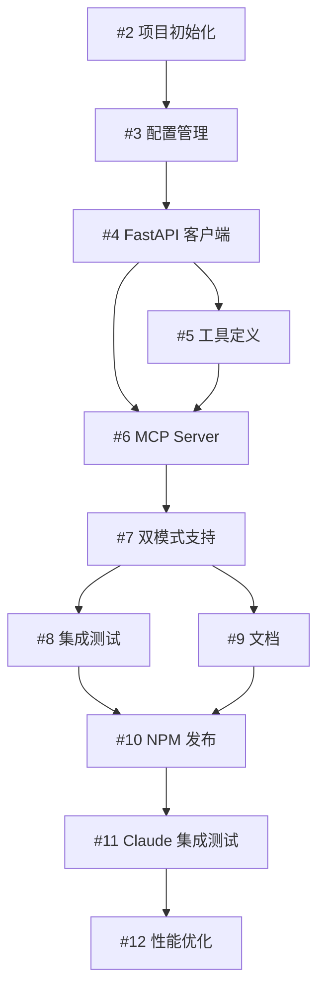

# Graphiti MCP HTTP Server - 项目概览

## 项目状态

**状态**: 规划完成 ✅
**仓库**: https://github.com/ourines/graphiti
**实施计划**: [IMPLEMENTATION_PLAN.md](IMPLEMENTATION_PLAN.md)

## Milestones 概览

### 📦 Milestone 1: 核心基础设施
**预计时间**: Week 1
**状态**: 待开始

| Issue | 标题 | 工作量 | 状态 |
|-------|------|--------|------|
| [#2](https://github.com/ourines/graphiti/issues/2) | 项目初始化和基础配置 | 4h | Open |
| [#3](https://github.com/ourines/graphiti/issues/3) | 配置管理系统实现 | 3h | Open |
| [#4](https://github.com/ourines/graphiti/issues/4) | FastAPI 客户端封装 | 5h | Open |

**总工作量**: 12 小时

---

### 🔌 Milestone 2: MCP 协议实现
**预计时间**: Week 2
**状态**: 待开始
**依赖**: Milestone 1

| Issue | 标题 | 工作量 | 状态 |
|-------|------|--------|------|
| [#5](https://github.com/ourines/graphiti/issues/5) | MCP 工具定义 | 3h | Open |
| [#6](https://github.com/ourines/graphiti/issues/6) | MCP Server 核心实现 | 6h | Open |
| [#7](https://github.com/ourines/graphiti/issues/7) | Stdio 和 HTTP 双模式支持 | 4h | Open |

**总工作量**: 13 小时

---

### ✅ Milestone 3: 测试和文档
**预计时间**: Week 3
**状态**: 待开始
**依赖**: Milestone 2

| Issue | 标题 | 工作量 | 状态 |
|-------|------|--------|------|
| [#8](https://github.com/ourines/graphiti/issues/8) | 集成测试和 CI/CD | 6h | Open |
| [#9](https://github.com/ourines/graphiti/issues/9) | 文档编写 | 4h | Open |

**总工作量**: 10 小时

---

### 🚀 Milestone 4: 发布和优化
**预计时间**: Week 4
**状态**: 待开始
**依赖**: Milestone 3

| Issue | 标题 | 工作量 | 状态 |
|-------|------|--------|------|
| [#10](https://github.com/ourines/graphiti/issues/10) | NPM 发布准备 | 3h | Open |
| [#11](https://github.com/ourines/graphiti/issues/11) | Claude Code 集成测试 | 3h | Open |
| [#12](https://github.com/ourines/graphiti/issues/12) | 性能优化和监控 (可选) | 5h | Open |

**总工作量**: 11 小时

---

## 项目总览

### 总体时间线

```
Week 1: 核心基础设施 (12h)
  │
  ├─ 项目初始化
  ├─ 配置管理
  └─ FastAPI 客户端
       │
Week 2: MCP 协议实现 (13h)
  │
  ├─ 工具定义
  ├─ MCP Server 核心
  └─ 双模式支持
       │
Week 3: 测试和文档 (10h)
  │
  ├─ 集成测试和 CI/CD
  └─ 文档编写
       │
Week 4: 发布和优化 (11h)
  │
  ├─ NPM 发布准备
  ├─ Claude Code 集成测试
  └─ 性能优化 (可选)
```

**总工作量**: 约 46 小时（~12 天 @ 4h/天）

### 依赖关系图



### 优先级分类

**P0 (Critical)** - 必须完成:
- #2, #3, #4, #5, #6, #11

**P1 (High)** - 强烈建议:
- #7, #8, #9, #10

**P2 (Medium)** - 可选:
- #12

## 技术栈

- **语言**: TypeScript 5.3+
- **运行时**: Node.js 18+
- **MCP SDK**: @modelcontextprotocol/sdk ^0.5.0
- **HTTP 框架**: Express ^4.18
- **测试**: Vitest
- **包管理**: pnpm
- **CI/CD**: GitHub Actions

## 快速开始

### 1. 开始开发

```bash
# 查看所有 issues
gh issue list --repo ourines/graphiti

# 查看特定 milestone
gh issue list --repo ourines/graphiti --milestone 1

# 开始处理 issue
gh issue develop 2 --repo ourines/graphiti
```

### 2. 项目结构（待创建）

```
mcp-http-server/
├── src/
│   ├── index.ts           # 入口
│   ├── server.ts          # MCP Server
│   ├── client.ts          # FastAPI 客户端
│   ├── config.ts          # 配置管理
│   └── tools.ts           # 工具定义
├── tests/
├── package.json
├── tsconfig.json
└── README.md
```

## 相关链接

- **实施计划**: [IMPLEMENTATION_PLAN.md](IMPLEMENTATION_PLAN.md)
- **GitHub Issues**: https://github.com/ourines/graphiti/issues
- **Milestones**: https://github.com/ourines/graphiti/milestones
- **原项目**: https://github.com/getzep/graphiti

## 下一步行动

1. 开始 [#2 项目初始化和基础配置](https://github.com/ourines/graphiti/issues/2)
2. 创建 `mcp-http-server/` 目录
3. 配置 TypeScript 开发环境
4. 完成基础脚手架

---

**最后更新**: 2025-10-03
**维护者**: @ourines
